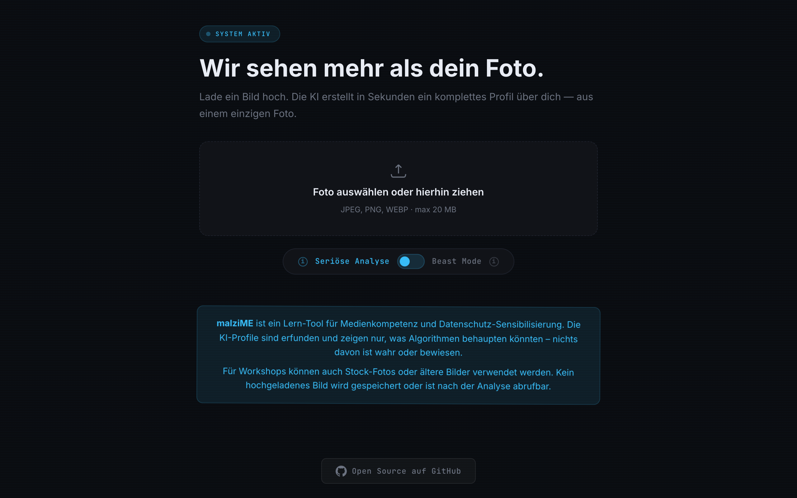
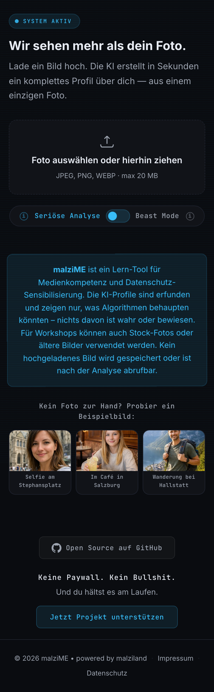

# malziME — Was KI aus deinem Foto liest

[](https://github.com/malziland/malzime/blob/main/LICENSE)
[](https://malzi.me)

[](https://github.com/malziland/malzime/actions/workflows/ci.yml)
[](https://github.com/malziland/malzime/actions/workflows/ci.yml)
[](https://github.com/malziland/malzime/actions/workflows/ci.yml)
[](https://github.com/malziland/malzime/actions/workflows/ci.yml)
[](https://github.com/malziland/malzime/actions/workflows/ci.yml)

> **[malzi.me](https://malzi.me)** — Jetzt ausprobieren

Workshop-Tool fuer Medienkompetenz und Datenschutz-Sensibilisierung. Zeigt Teilnehmer:innen, was KI-Algorithmen aus einem einzigen Foto ableiten koennten — inklusive Persoenlichkeitsprofil, Werbe-Targeting und Manipulationstrigger.

**Alles erfunden. Nichts davon ist wahr oder bewiesen.**

<p align="center">
  
</p>
<p align="center">
  
</p>

## Features

- **Zwei Modi**: Serioese Analyse (sachlich) und Beast Mode (uebertrieben-provokant)
- **Datenwert-Rechner**: Zeigt was ein Profil fuer Datenbroker wert ist
- **Privacy-Check**: Erkennt ungewollt preisgegebene Informationen (Telefonnummern, Adressen, Kennzeichen)
- **EXIF-Analyse**: Zeigt versteckte Kamera-Metadaten (client-seitig extrahiert)
- **GPS-Karte**: Zeigt den Aufnahmeort auf einer Karte (GPS verlässt nie den Browser)
- **Easter Egg**: Tierfotos bekommen ein lustiges Spass-Profil
- **PDF-Export**: Ergebnisse als PDF speichern (fuer Workshop-Diskussionen)
- **Demo-Fotos**: 3 anklickbare Stock-Fotos mit Fake-EXIF fuer Workshops (echte KI-Analyse, kein vorgefertigtes Ergebnis)
- **Mehrsprachig vorbereitet**: i18n-System fuer UI, Prompts und Tierprofile (aktuell Deutsch)
- **Kein Tracking**: Keine Cookies, keine Analytics, keine Werbung, keine Speicherung

## Architektur

```
public/                     Firebase Hosting (SPA, kein Build-Schritt)
  index.html                Hauptseite
  app.js                    Entry Point (ES Module)
  js/                       Frontend-Module (api, dom, exif, geocoding, i18n, render, state, ui)
  locales/                  Frontend-Locale-Dateien (de.json, manifest.json)
  styles.css                Dark-Theme CSS + Print Styles
  __tests__/                Vitest Frontend-Tests
  impressum.html            Impressum
  datenschutz.html          Datenschutzerklaerung
  fonts/                    Self-hosted: Inter + JetBrains Mono (woff2)
  lib/leaflet/              Self-hosted: Leaflet 1.9.4
  lib/exifr/                Self-hosted: exifr lite (EXIF-Parsing im Browser)

functions/src/              Firebase Cloud Functions (2nd Gen, Node 24, europe-west1)
  index.js                  HTTP-Handler (analyze-Endpunkt, Tier-Check, Magic-Byte-Validierung)
  config.js                 Konstanten, Modell-Listen, Limits
  animal.js                 Personen-/Tier-Erkennung (Word-Boundary-Matching) + Easter-Egg-Profile
  middleware.js              Rate Limiting (IP-basiert, 200/10min), IP-Extraktion
  upload.js                 Multipart- und JSON-Body-Parsing
  vision.js                 Google Cloud Vision API (EU-Endpoint, TEXT + LABEL_DETECTION)
  privacy.js                Datenschutz-Risiko-Erkennung aus OCR/Labels
  gemini.js                 Vertex AI Gemini (Bildbeschreibung + Profilgenerierung)
  i18n.js                   Backend-Locale-Loader (loadPrompts, loadAnimals, resolveLanguage)
  locales/                  Backend-Locale-Dateien (de/prompts.js, de/animals.js, manifest.json)
  __tests__/                Jest Unit-Tests
```

## Privacy-Architektur

Datenschutz ist kein Feature — es ist das Fundament:

- **EXIF-Extraktion im Browser**: exifr parsed die Metadaten lokal, GPS verlässt nie den Client
- **Server bekommt kein GPS**: Nur komprimiertes Bild + Kamera-Hersteller/Modell (ohne GPS, ohne dateTimeOriginal)
- **Geocoding direkt vom Browser**: Nominatim wird client-seitig aufgerufen, nicht ueber den Server
- **Keine Speicherung**: Weder Bilder noch Profile werden gespeichert — alles RAM-only
- **Keine externen Scripts**: Alle Assets self-hosted (Fonts, Leaflet, exifr). Kein Google Fonts CDN, kein unpkg, kein reCAPTCHA, kein Firebase SDK
- **Bot-Schutz ohne Tracking**: Rate Limiting (IP), Honeypot-Feld, Timing-Check
- **Strenge CSP**: Nur `self` + OpenStreetMap Tiles + Nominatim

## Schnellstart

```bash
# 1. Repo klonen
git clone https://github.com/malziland/malzime.git
cd malzime

# 2. Firebase CLI installieren (falls noch nicht vorhanden)
npm i -g firebase-tools
firebase login

# 3. Dependencies installieren
npm install                          # Frontend-Tests (Vitest)
cd functions && npm install && cd .. # Backend

# 4. Lokal testen
firebase emulators:start --only functions,hosting

# 5. Deploy
firebase deploy --only functions,hosting
```

Detaillierte Anleitung: [`docs/SETUP.md`](docs/SETUP.md) | Eigene Instanz aufsetzen: [`docs/SELF-HOSTING.md`](docs/SELF-HOSTING.md)

## API

`POST /analyze` — JSON oder multipart/form-data

### Request (JSON)

```json
{
  "imageBase64": "...",
  "mimeType": "image/jpeg",
  "filename": "upload.jpg",
  "exif": { "make": "Apple", "model": "iPhone 15 Pro" },
  "lang": "de",
}
```

| Feld | Typ | Beschreibung |
|------|-----|--------------|
| `imageBase64` | string | Base64-kodiertes Bild (client-seitig komprimiert) |
| `mimeType` | string | `image/jpeg`, `image/png`, `image/webp`, `image/gif` |
| `exif` | object | Kamera-Metadaten vom Client (ohne GPS!) |
| `lang` | string | Sprachcode (`de`, `en`, ...). Default: `de` |

### Response

```json
{
  "profiles": {
    "normal": {
      "categories": {},
      "ad_targeting": [],
      "manipulation_triggers": [],
      "profileText": ""
    },
    "boost": { "..." }
  },
  "privacyRisks": [],
  "exif": {},
  "meta": {
    "requestId": "abc12345",
    "mode": "multimodal"
  }
}
```

`mode` kann sein: `multimodal`, `demo`, `animal`, `blocked`

Bei Tieren enthalten `profiles.normal` und `profiles.boost` ein lustiges Easter-Egg-Profil.
Bei blockierten Bildern ist `profiles: null` und `blockedReason` enthaelt den Grund.

## Sicherheit

- **Content Security Policy** mit strikter Whitelist
- **HSTS** mit Preload
- **X-Frame-Options: DENY**
- **X-Content-Type-Options: nosniff**
- **Magic-Byte-Validierung**: Server prueft JPEG/PNG/WebP/GIF-Header
- **Honeypot-Feld** gegen Bots
- **Rate Limiting**: 200 Requests / 10 Minuten pro IP
- **Timing-Check**: Requests innerhalb von 2s nach Seitenaufruf werden verzoegert
- **Prompt-Injection-Schutz**: User-Daten in XML-Tags isoliert, Gemini ignoriert Anweisungen darin
- **Keine Datenspeicherung**: Alles im RAM, keine Datenbank, kein Logging von Bilddaten

## Tests

```bash
# Backend (Jest, 124 Tests)
cd functions && npm test

# Frontend (Vitest + jsdom, 69 Tests)
npm run test:frontend

# Linting
cd functions && npm run lint           # Backend ESLint
npm run lint:frontend                  # Frontend ESLint
cd functions && npm run format:check   # Backend Prettier
npm run format:frontend:check          # Frontend Prettier
```

**Backend (124 Tests):** HTTP-Handler, Tier-Erkennung (Word-Boundary-Matching), Config, Demo-Daten, Middleware (Rate Limiting), Privacy-Risiken, Upload-Parsing, Vision API, Magic-Byte-Validierung, EXIF-Sanitization, i18n-Guardian.

**Frontend (69 Tests):** DOM-Helpers, State, Scan-Animation, Disclaimer-Modal, Geocoding, Render-Pipeline, API-Integration (mit fetch-Mock), i18n-Modul, i18n-Guardian.

## CI/CD

GitHub Actions Workflow `.github/workflows/ci.yml`:

- **Tests + Lint** bei jedem Push und Pull Request (Backend + Frontend)
- **Secret-Scan** via gitleaks (prueft auf versehentlich committete API-Keys)
- **Dependabot** prueft monatlich auf unsichere Dependencies (npm + GitHub Actions)
- **npm audit** im Backend-Job (blockiert bei kritischen Schwachstellen)
- Deploy erfolgt manuell per `npx firebase deploy`

## Tech-Stack

| Komponente | Technologie |
|-----------|-------------|
| Hosting | Firebase Hosting |
| Backend | Firebase Cloud Functions (2nd Gen, Node 24) |
| KI-Beschreibung | Vertex AI Gemini 2.5 Flash (Multimodal) |
| KI-Profile | Vertex AI Gemini 2.5 Flash (Text) |
| Bilderkennung | Google Cloud Vision API (EU-Endpoint) |
| Karten | Leaflet + OpenStreetMap (self-hosted) |
| Geocoding | Nominatim (client-seitig) |
| EXIF-Parsing | exifr (client-seitig im Browser) |
| Fonts | Inter + JetBrains Mono (self-hosted, woff2) |
| i18n | Eigenes Micro-Modul (Frontend JSON + Backend CommonJS Locales) |
| Frontend | Vanilla JS, kein Framework, kein Build-Schritt |

## Einschraenkungen

- **EU Vision API** (`eu-vision.googleapis.com`) unterstuetzt nur `TEXT_DETECTION` und `LABEL_DETECTION`. `FACE_DETECTION` und `OBJECT_LOCALIZATION` sind nicht verfuegbar und wuerden den gesamten API-Call crashen.
- **Safety-Filter**: Googles Sicherheitsfilter blockieren die Bildbeschreibung bei Fotos von Kindern oder Jugendlichen. In diesem Fall wird ein Fallback ueber Vision-API-Labels genutzt.
- **Alters-Labels**: Vision API Labels wie "Toddler" oder "Baby" sind unzuverlaessig und werden gefiltert. Altersschaetzung erfolgt ausschliesslich durch Gemini anhand physischer Merkmale.
- **Personen-Erkennung**: Die EU Vision API erkennt Personen in Outdoor-/Natur-Szenen oft nicht. Nur bei reinen Tier-Labels wird die Analyse blockiert — in allen anderen Faellen entscheidet Gemini.

## Datenschutz

- Keine Bilder, Profile oder Nutzerdaten werden gespeichert
- Keine Tracking-Cookies, keine Analytics, keine Werbung
- Kein Firebase SDK im Frontend, kein reCAPTCHA
- KI-Analyse laeuft ueber Google Cloud (EU, europe-west1)
- GPS-Daten verlassen nie den Browser des Nutzers
- Details: [malzi.me/datenschutz](https://malzi.me/datenschutz)

## Lizenz

MIT — siehe [LICENSE](LICENSE)

---

Erstellt von [malziland — digitale Wissensgestaltung](https://malziland.at)
